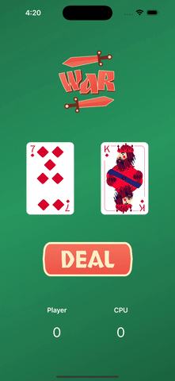

# War Card Game

A simple **War Card Game** built using **SwiftUI** to practice and learn the Swift programming language and SwiftUI framework.

## 🎮 Game Overview

The War Card Game is a fun, beginner-friendly app where a player competes against the CPU. The player presses the **Deal** button, and the app randomly selects a card for both the player and the CPU. The winner is determined based on the card values, and the result is displayed on the screen.

## 🚀 Features

- Random card generation for the player and CPU.
- Comparison logic to determine the winner.
- Simple and interactive UI built with **SwiftUI**.
- Lightweight app designed for learning purposes.

## 📸 Demo

## 🛠️ Technologies Used

- **Swift Programming Language**
- **SwiftUI Framework**

## 🧠 Learning Objectives

This project was created as a part of the journey to learn Swift and SwiftUI. It covers:
- Basic Swift programming concepts.
- Working with random number generation.
- State management in SwiftUI
- Simple UI design
- Logic implementation

## 📜 Rules of the Game
1. Click the Deal button to draw a card for both the player and the CPU.
2. The app compares the values of the cards:
  - The card with the higher value wins.
  - If both cards have the same value, it’s a draw.
3. The result is displayed on the screen.

## 🤝 Contributing

This project was developed as a learning exercise, but contributions are welcome! Feel free to:
- Fork the repository.
- Create feature requests or report issues in the Issues section.
- Submit pull requests for improvements.
